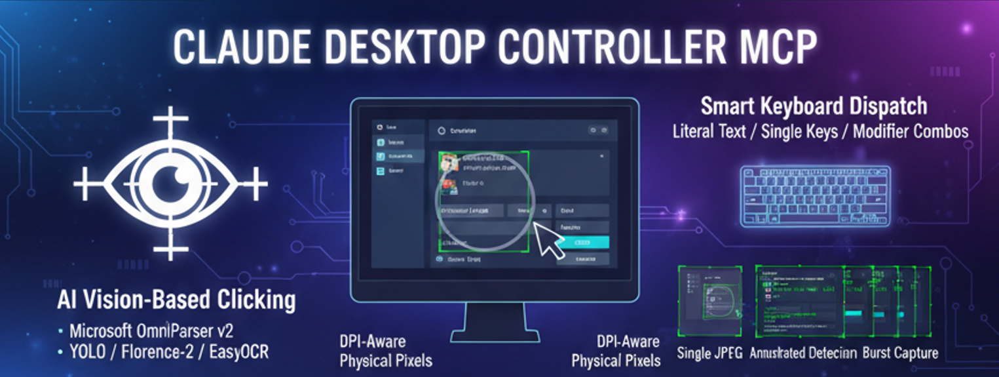

# desktop-control-mcp



A Windows desktop automation server that exposes mouse, keyboard, screen capture, and AI-powered UI element detection through two interfaces:

- **MCP server** (`mcp_server.py`) — stdio transport, designed for use with Claude Code, Claude Desktop, and other MCP clients
- **HTTP server** (`server.py` + `app.py`) — a Flask API on `http://localhost:7845`, runnable from a system tray icon

Both interfaces share the same underlying `controller.py` (Windows automation) and `ui_parser.py` (vision models), so capabilities are identical.

---

## Highlights

- **AI vision-based clicking** — UI elements are detected with [Microsoft OmniParser v2](https://huggingface.co/microsoft/OmniParser-v2.0) (YOLO icon detector + Florence-2 captioner + EasyOCR), so you can target buttons/fields by intent rather than by guessing pixel coordinates from a screenshot.
- **DPI-aware** — runs as `PROCESS_PER_MONITOR_DPI_AWARE`, so coordinates are always physical pixels regardless of Windows display scaling.
- **Cursor in screenshots** — the real Windows cursor bitmap is composited into every screenshot via the Win32 GDI API, so AI clients can see where the mouse is.
- **Three screenshot modes** — single compressed JPEG, annotated detection view, and time-spread burst capture (for observing animations or loading states).
- **Smart keyboard dispatch** — separate tools for literal text, single keys, and modifier combos so `"ctrl+c"` is never accidentally typed as text.

---

## Installation

Requires Windows and Python 3.10+.

```bash
git clone https://github.com/ahmetdenizyilmaz/desktop-control-mcp.git
cd desktop-control-mcp
pip install -r requirements.txt
```

On first run, OmniParser v2 model weights (~1 GB) are downloaded from Hugging Face into the local cache. GPU is used automatically if a CUDA-enabled PyTorch is installed; otherwise CPU is used.

---

## Running

### As an MCP server (stdio)

Add an entry like this to your MCP client config (e.g. Claude Desktop / Claude Code):

```json
{
  "mcpServers": {
    "desktop-control": {
      "command": "python",
      "args": ["C:\\path\\to\\desktop-control-mcp\\mcp_server.py"]
    }
  }
}
```

The server boots immediately; models load in a background thread so the first `detect_ui_elements` call waits for them but the rest of the tools are available right away.

### As an HTTP server with tray icon

```bash
python app.py
```

A tray icon appears with Start / Stop / Quit. The Flask API listens on `http://localhost:7845`. See [`API_DOCS.md`](API_DOCS.md) for endpoint details.

---

## MCP tools

### Screen info

| Tool | Description |
|------|-------------|
| `get_screen_size()` | Primary monitor resolution. Call once to learn the coordinate space. |
| `get_active_window()` | Title, position, and size of the currently focused window. |

### Screenshots

| Tool | Description |
|------|-------------|
| `take_screenshot(quality=30)` | Compressed JPEG of the primary monitor. For *observation* only — do not derive coordinates from it. |
| `detect_ui_elements(confidence_threshold=0.5, full_response=False)` | Runs OmniParser + EasyOCR, returns an annotated image plus a table of `(id, type, confidence, center, label)` for every detected element. **This is how you find coordinates to click.** |
| `take_screenshot_burst(frame_count=10, duration_seconds=1.0)` | Captures N frames evenly spread over a duration. Useful for animations, loading spinners, or timing-sensitive UI. |

### Mouse

| Tool | Description |
|------|-------------|
| `click_mouse(x, y, button="left")` | Single click. Always use coordinates from `detect_ui_elements`. |
| `double_click(x, y)` | Double-click. |
| `move_mouse(x, y)` | Move cursor without clicking. |
| `drag_mouse(x1, y1, x2, y2, button="left")` | Click-and-drag. |
| `scroll(x, y, direction, amount=3)` | Wheel scroll at a position (`up`/`down`/`left`/`right`). |

### Keyboard

| Tool | When to use |
|------|-------------|
| `type_text(text)` | Plain text input (filenames, search queries, URLs, code). Never interprets `+` as a hotkey. |
| `press_key(key, presses=1)` | A single named key (`enter`, `tab`, `escape`, `f5`, arrow keys, `delete`, etc.). |
| `send_keys(text)` | Modifier+key combos only (`ctrl+c`, `alt+tab`, `win+d`, `ctrl+shift+s`). |

---

## The mandatory click workflow

Coordinates are not stable across screen changes — every menu opens, every dialog appears, every scroll moves things. The server enforces this loop:

1. **DETECT** — `detect_ui_elements` returns the current element table.
2. **FIND** — match your target in the `Label` column.
3. **CLICK** — `click_mouse(x, y)` using the exact `Center` coordinates from the table.
4. **VERIFY** — `take_screenshot` to confirm the click landed.
5. **RECOVER** — if the click missed, re-detect (the screen may have changed) and retry.

Never guess coordinates from a raw screenshot. The element table from `detect_ui_elements` is the source of truth.

### Example element table

```
  ID  Type   Conf   Center         Label
   1  text   0.98   ( 499,   55)   File  Edit  View
   2  icon   0.91   ( 674,  200)   Search button
   3  icon   0.87   (1200,  400)   Close
```

To click the search button: `click_mouse(x=674, y=200)`.

---

## HTTP API

When run as `app.py`, the Flask server on port `7845` mirrors the MCP tools:

| Endpoint | Purpose |
|----------|---------|
| `GET /health` | Liveness check. |
| `POST /screenshot` | Returns a base64 PNG of the screen. |
| `POST /move` | `{x, y}` — move cursor. |
| `POST /click` | `{x, y, button?}` — click. |
| `POST /keys` | `{keys}` — text or hotkey (auto-detected). |
| `POST /command` | Single bracket command like `[ClickMouse(500,300)]`. |
| `POST /actions` | List of bracket commands run sequentially with an optional `delay` between them. |

Full request/response schemas are in [`API_DOCS.md`](API_DOCS.md).

---

## File layout

```
mcp_server.py          FastMCP server — tool definitions and lifespan
controller.py          Win32 / pyautogui / mss core — screenshots, input, window info
ui_parser.py           OmniParser v2 loading + UI detection + image annotation
screenshot_manager.py  Disk-side screenshot cache (cleanup, naming, burst dirs)
overlay.py             On-screen overlay utilities
lock_manager.py        Concurrency lock for shared resources
server.py              Flask HTTP API
app.py                 Tray-icon launcher for the Flask server
templates/index.html   Web UI for the Flask server
requirements.txt       Python dependencies
API_DOCS.md            HTTP endpoint reference
run_agents.bat         Convenience launcher for Claude Code in this folder
```

---

## Platform notes

- **Windows only.** The cursor compositing, DPI awareness, and active-window code use Win32 APIs directly.
- **Primary monitor only.** All coordinates are in the primary monitor's pixel space.
- **First detection is slow.** OmniParser model load + EasyOCR initialization can take 30–60 seconds on first call. Subsequent detections are fast (sub-second on GPU, a few seconds on CPU).
